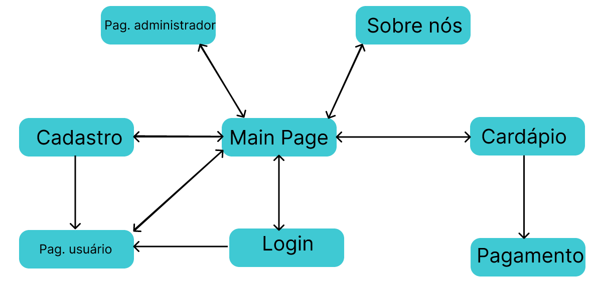

# Milestone2 - Report
   Gabriel Ribeiro Fonseca de Freitas - 12542651  

# Requisitos:
1 - O nosso e-commerce é a “USPão”,uma padaria online que realiza entregas de pães,bolos,doces, entre outros produtos.

   2 - Nosso site possui dois tipos de usuários:
   
  2.1 - O consumidor: aquele que tem acesso ao sistema para comprar os produtos
  
  2.2 - O administrador: neste caso,este usuário é a própria padaria.Responsável por analisar os estoques dos produtos e definir a logística de venda.
  
  

   3 - Nossos consumidores podem se cadastrar no sistema e terem sua própria conta.Assim, guardamos essas informações cadastradas (nome,telefone,email,data de nascimento,endereço) em nosso banco de dados.

   4 - Nossas vendas serão feitas por meio dos dados do cartão de crédito ou pix. Por questões de falta de infraestrutura de segurança,nosso sistema não guardará informações referentes aos dados do cartão de crédito do usuário, portanto é necessário que os dados sejam colocados a cada compra.Já o pagamento por pix, será gerado um QR code com o qual poderá ser realizado o pagamento.

   5 - Como funcionalidade especial,nosso site oferece um sistema de descontos,que salva os dados dos produtos mais vendidos naquele horário do dia e coloca em destaque na página principal com um certo desconto.

# Descrição do projeto:
   Como já especificado,o nosso site consiste em uma padaria online chamada “USPão”.
   
   Assim que abrir o site, o usuário entrará na Main Page,onde vai se deparar com o nosso desconto do dia em destaque ao meio e com a nossa "sidebar” logo ao lado superior esquerdo.Essa sidebar,presente em quase todas as páginas, permite que o usuário trafegue por todo o site com muita facilidade,como pode ser visto no diagrama:

O usuário tem acesso ao cardápio com diversas opções de produtos,que podem ser colocados no carrinho e, a partir disso,direcionados à [página de pagamento](https://www.figma.com/proto/HlBWvq9y5X4Qf4ujMj5DDb/Untitled?node-id=2%3A2&scaling=min-zoom&page-id=0%3A1).

O usuário também poderá se cadastrar em nosso site,tendo acesso a uma [página do cliente](https://www.figma.com/proto/HlBWvq9y5X4Qf4ujMj5DDb/Untitled?node-id=20%3A289&scaling=min-zoom&page-id=17%3A234) com sua foto de perfil,email,telefone e sua opção de café automático.O café automático é um sistema em que o usuário cria o seu carrinho de compras,coloca um crédito em sua carteira virtual e escolhe o horário em que deseja receber aqueles prudutos.Com isso,todos os dias a padaria,através do sistema, é avisada com uma certa antecedência e envia para a casa da pessoa aqueles produtos sem que a pessoa precise solicitar o pedido todos os dias.
   
A [página do administrador](https://www.figma.com/proto/HlBWvq9y5X4Qf4ujMj5DDb/Untitled?node-id=20%3A327&scaling=min-zoom&page-id=20%3A326) é de acesso somente da padaria,porque através dessa página é possível observar as quantidades de todos os produtos no estoque e reforçá-lo quando necessário.

# Comentários sobre o código:
   Sem comentários.

# Plano de testes:
   Logo que abrir o projeto,você será direcionado à HomePage,onde logo encontrará a nossa funcionalidade especial,os destaques do dia.Mas a baixo na nessa página,você poderá conhecer um pouco mais da nossa história na seção "O que é USPão?".Por último,você poderá realizar o login com sua conta na seção "Conecte-se com sua conta USPão".Caso não tenha uma conta ainda,basta clicarem cadastre-se e você será redirecionado à página de cadastro. 
   
   Em nossa Navigation Bar,você poderá clicar em três outros liks que o direcionarão a outras partes do projeto:o cardápio,o cadastro e a página de administrador. 
   
   No cardápio,você encontrará várias opções de produtos,podendo clicar em seus cards para adioná-los ao carrinho de compras.No carrinho,ao clicarem finalizar compra,você será direcionado à página de pagamento,onde é possível confirmar seus pedidos e colocar suas informações pessoais,referentes ao seu endereço e dados do cartão de cŕedito. 
   
   Na página do administrador,é possível adicionar novos produtos que serão direcionados ao cardápio para atualizar o estoque da loja. 
   
   Por fim,na página de cadastro,é possível realizar seu cadastro para se tornar um membro USPão.
   
   
# Procedimentos de execução:
   Para rodar a aplicação,você precisa ter a versão  17.3.1 do node em seu computador. 
   
   Com isso,após baixar o repositório milestone-2,rode "$ npm run serve" e clique no link que aparecer em "Local:(...)"
   

# Problemas:

# Comentários:
